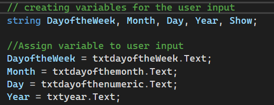
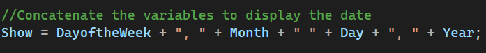
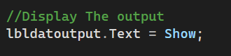
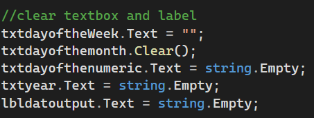
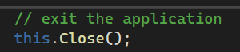

# discuss chapter 1
Key Theoretical Concepts
1. Objects and Controls
Objects: Software components containing properties (data settings) and methods (actions/operations).

Controls: Visual screen objects (e.g., Label, TextBox, Button) used to design a Graphical User Interface (GUI).

2. Event-Driven Programming
Programs wait for user actions (like clicking a button or typing text).

An Event Handler is a method executed automatically when a specific event occurs.

3.  Code Organization
Namespace: Holds one or more classes.

Class: Holds methods and properties associated with a form.

Method: Contains programming statements that perform an action.

Code Implementation Breakdown
1. Variable Declaration & Reading Control Text
Declares string variables in a single line and captures user entries from form textboxes using the .Text property.

// creating variables for the user input
string DayoftheWeek, Month, Day, Year, Show;

// Assign variable to user input
DayoftheWeek = txtdayoftheWeek.Text;
Month = txtdayofthemonth.Text;
Day = txtdayofthenumeric.Text;
Year = txtyear.Text;

2. String Concatenation
Uses the + string operator to combine variables and explicit literal strings (", " and " ") into a single formatted string.

// Concatenate the variables to display the date
Show = DayoftheWeek + ", " + Month + " " + Day + ", " + Year;

3. Displaying Output in a Label Control
Sets the .Text property of a Label control to output the concatenated string to the GUI.
// Display The output
lbldatoutput.Text = Show;

4. Clearing Controls
Resets form controls back to blank using three common C# techniques: an empty literal (""), calling .Clear(), and assigning string.Empty.

// clear textbox and label
txtdayoftheWeek.Text = "";
txtdayofthemonth.Clear();
txtdayofthenumeric.Text = string.Empty;
txtyear.Text = string.Empty;
lbldatoutput.Text = string.Empty;

5. Closing the Application
Closes the active form window.

// exit the application
this.Close();

