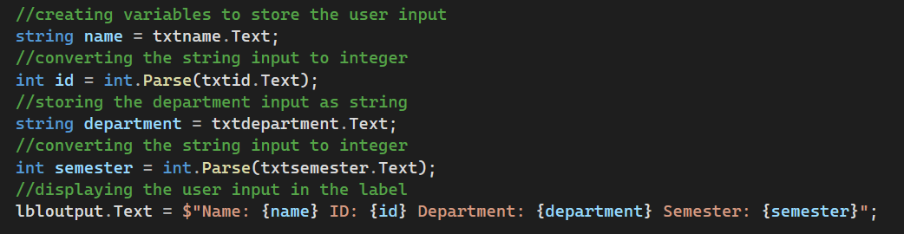
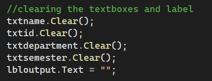
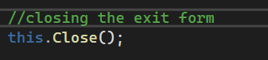

# screenshot1 discuss

-Input Processing & Variable Assignment
The primary functionality captures user input from text fields, parses numerical data where necessary, and displays the formatted summary in an output label.

# screenshot2 discuss
-Resetting / Clearing Inputs
This section clears all input fields and resets the output display area back to an empty state.

# screenshot2 discuss
Application / Form Exit
This handler safely closes the current application window or active form.

